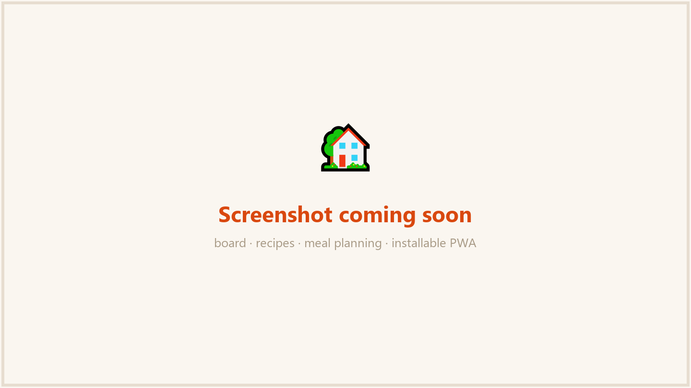
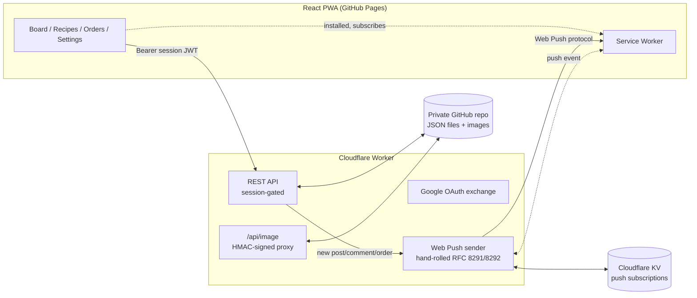

<div align="center">

# 🏡 Family

A private, installable web app for a household to post updates, share recipes, and plan meals together — built with **zero traditional backend infrastructure**: no database, no VM, no container. Just a Cloudflare Worker, a GitHub repo used as a JSON data store, and a React PWA.

[Live demo (login required)](https://frobel0520.github.io/Family/) · [Architecture](#architecture) · [Notable engineering](#notable-engineering)

</div>

<!-- TODO: swap in real screenshots (board / recipes / settings), redact any visible names/photos first -->
<p align="center">
  
</p>

---

## Why this exists

Most "family app" side projects stop at a CRUD list. This one had to survive actual daily use by non-technical relatives on their phones — which forced real engineering problems that a toy project usually skips:

- People needed to **log in with the Google account they already have**, not a GitHub account, not a new password.
- The site needed to feel like an **app**, not a bookmarked webpage — installable, with its own icon, opening full-screen.
- Family members expected **push notifications** the moment someone posts, the way any commercial app behaves.
- Photos and posts are personal. Once real content was flowing in, "who can see this" stopped being theoretical and became a real access-control problem to solve properly, on a $0 budget.

Each of those turned into a small, self-contained piece of infrastructure — described below — done without paying for a database, an email service, or a push notification provider.

## Architecture



**No database.** Every mutation (`data/board.json`, `recipes.json`, `orders.json`, `profiles.json`) is a `git commit` made through GitHub's Contents API, using a bot token so family members never need write access to any repo. Reads go through the same API rather than `raw.githubusercontent.com`, avoiding CDN propagation delay on just-written data. It's not a design anyone would pick for scale — it's a deliberate trade for "zero infra, full history, free forever" at household scale, and the constraint turned out to force some interesting solutions of its own (see below).

**No server-rendering, no server at all in the traditional sense.** The frontend is a static React SPA on GitHub Pages; the Worker is the only piece of custom backend logic, and it's stateless — session identity is a signed JWT, not a server-side session store.

## Notable engineering

A few pieces that go beyond typical CRUD-app plumbing:

- **Web Push implemented from the RFC, not a library.** `npm install web-push` doesn't run on Cloudflare Workers' isolate runtime. [`web-push.ts`](worker/src/web-push.ts) implements RFC 8291 (`aes128gcm` payload encryption) and RFC 8292 (VAPID JWT auth) directly on top of WebCrypto — and it's checked against the [official RFC 8291 Appendix A test vector](worker/test/web-push.spec.ts) byte-for-byte, not just "seems to work in Chrome."

- **A capability-URL image proxy, not session-bound access.** Once the data repo went private, images could no longer be linked directly (`raw.githubusercontent.com` requires the repo to be public). Rather than gate every image fetch behind a short-lived session token — which would turn a stale post's avatar into a broken image the moment its author's session expired — [`image-url.ts`](worker/src/image-url.ts) HMAC-signs the *file path itself*, with no expiry. The signature is the credential; it only ever reaches a client through an already-authenticated API response, and a version component (an update timestamp) is folded into the signed message so replacing an avatar or recipe photo invalidates the old link instead of being cached forever.

- **A same-origin, no-JS-framework PWA install/notification flow**, handling the actual cross-platform mess: iOS only allows requesting notification permission from an already-installed home-screen app (not from Safari), Android's status-bar badge icon must be a *transparent, monochrome* silhouette or it silently renders as a blank square, and same-category push notifications are collapsed and counted via `Notification.tag` + `getNotifications()` rather than stacking indefinitely.

- **A login-approval queue instead of a static allowlist.** New Google sign-ins land in a pending queue (itself just another JSON file, written the same way as everything else) that only the owner account can approve or deny — chosen specifically over a `.env` allowlist because that would mean redeploying secrets every time a new family member joins.

- **Auth-gated everything, the hard way (learned in production).** The API originally let board/recipe/order *reads* bypass login for convenience. Closing that gap later meant coordinating a breaking backend change with a matching frontend change — deployed slightly out of sync once, which briefly broke the live app for actual users. That mistake, and the fix, are part of the commit history.

## Stack

| Layer | Choice | Why |
|---|---|---|
| Frontend | React 19 + Vite, `HashRouter` | Static hosting on GitHub Pages has no server-side routing |
| Backend | Cloudflare Workers (TypeScript) | Free tier, no server to patch, edge-deployed |
| "Database" | JSON files in a private GitHub repo, via the Contents API | No hosting cost, full history/audit-log for free |
| Auth | Google OAuth (Authorization Code flow), signed JWT sessions | Family members already have Google accounts |
| Push | Hand-rolled Web Push (RFC 8291/8292) + Cloudflare KV for subscriptions | No third-party push service |
| Install | Web App Manifest + Service Worker (no offline caching by design) | Installable on iOS/Android without an app store |
| Testing | Vitest + `@cloudflare/vitest-pool-workers` | Runs actual Worker code in Miniflare, not mocked fetches |

## Project structure

```
frontend/   React PWA — pages, components, auth context, push subscription logic
worker/     Cloudflare Worker — routes, GitHub Contents API client, JWT/session,
            Web Push crypto, image-signing, tests
```

## Local development

```bash
# Worker (Cloudflare)
cd worker
npm install
npm run dev      # wrangler dev
npm test         # vitest, including the RFC 8291 test vector check

# Frontend
cd frontend
npm install
npm run dev      # vite dev server
```

Both need their own `wrangler secret` / `.env` values (Google OAuth client, a GitHub fine-grained PAT scoped to a private data repo, a JWT signing secret, VAPID keys) — there's no shared config file, on purpose, since none of those values belong in git.

## Deployment

- **Frontend** builds and deploys to GitHub Pages via GitHub Actions on every push to `main`.
- **Worker** deploys with `wrangler deploy` (not currently automated in CI — a deliberate manual gate for a backend change).
